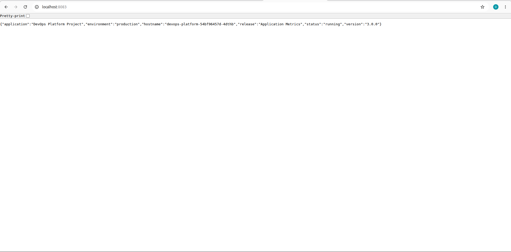
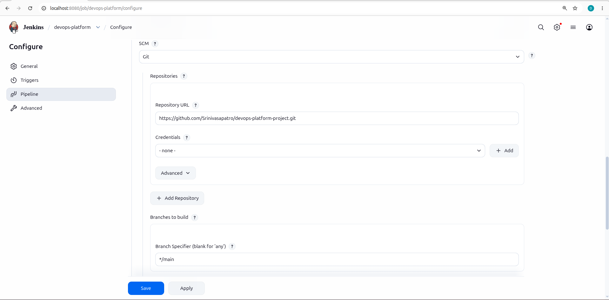
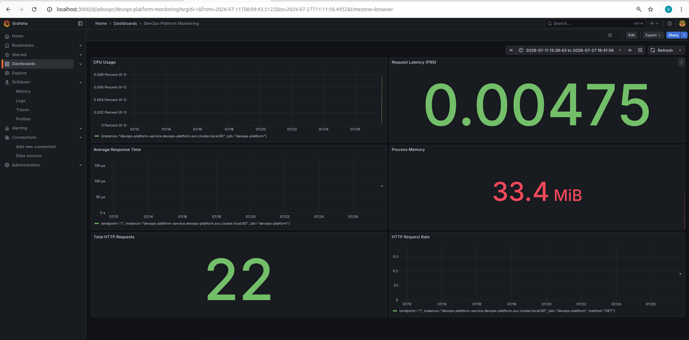
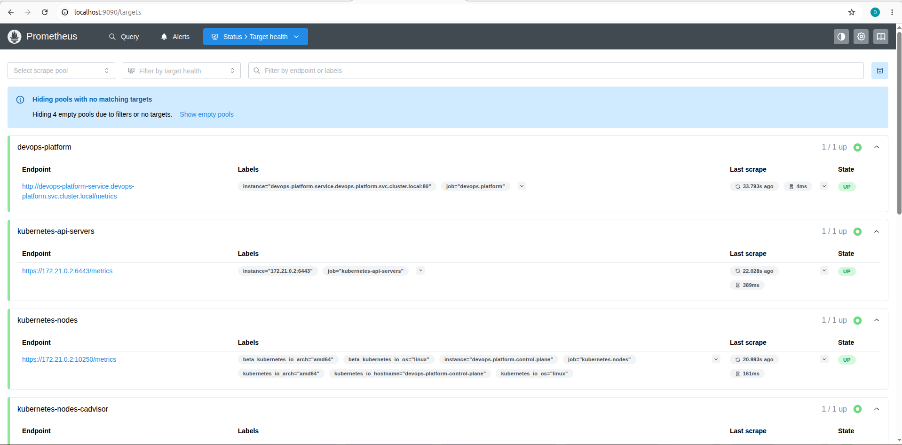
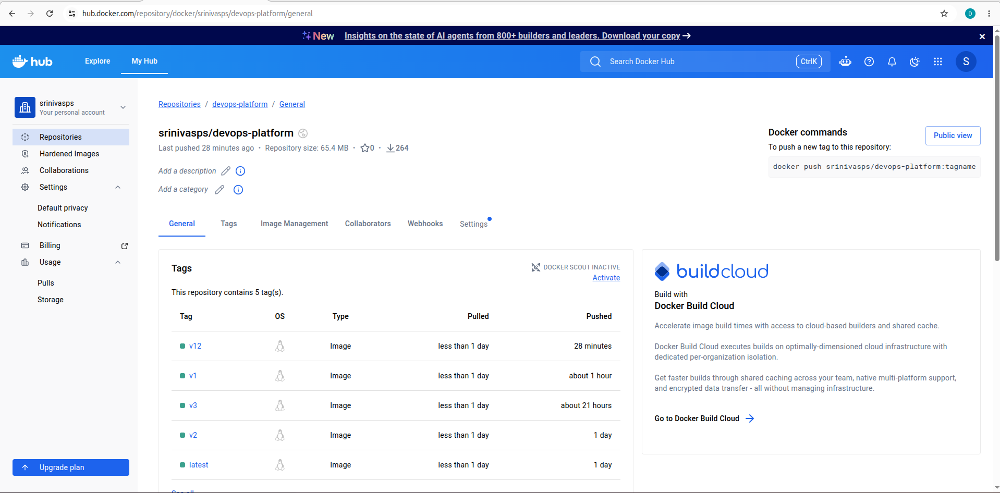

# DevOps Platform Project

A production-style DevOps project demonstrating a complete CI/CD pipeline using Jenkins, Docker, Kubernetes, Prometheus, Grafana, and Helm.

## Project Overview

This project automates the complete software delivery lifecycle.

The pipeline performs:

- Source Code Management with Git & GitHub
- Continuous Integration using Jenkins
- Automated Testing using Pytest
- Docker Image Build
- Docker Hub Image Publishing
- Kubernetes Deployment
- Prometheus Metrics Collection
- Grafana Monitoring Dashboard

---

## Technology Stack

| Category | Technology |
|-----------|------------|
| Language | Python (Flask) |
| Containerization | Docker |
| CI/CD | Jenkins |
| Container Registry | Docker Hub |
| Orchestration | Kubernetes |
| Package Management | Helm |
| Monitoring | Prometheus |
| Visualization | Grafana |
| Testing | Pytest |
| Version Control | Git & GitHub |

---
## Architecture

```text
                    GitHub
                       │
                  Git Push
                       │
                       ▼
                   Jenkins CI
                       │
         ┌─────────────┴──────────────┐
         │                            │
         ▼                            ▼
     Run Tests                 Build Docker Image
         │                            │
         └─────────────┬──────────────┘
                       ▼
             Push Image to Docker Hub
                       │
                       ▼
                 Helm Deployment
                       │
                       ▼
               Kubernetes Cluster
                       │
        ┌──────────────┴─────────────┐
        │                            │
        ▼                            ▼
   Flask Application             Service
        │
        ▼
 Prometheus Metrics (/metrics)
        │
        ▼
     Prometheus Server
        │
        ▼
        Grafana Dashboard
```
## Project Structure

```text
devops-platform-project/
│
├── app/
│   ├── app.py
│   ├── Dockerfile
│   ├── requirements.txt
│   └── __init__.py
│
├── tests/
│   └── test_app.py
│
├── kubernetes/
│   ├── deployment.yaml
│   ├── namespace.yaml
│   └── service.yaml
│
├── helm/
│
├── monitoring/
│
├── screenshots/
│
├── Jenkinsfile
├── README.md
└── requirements.txt
```
## CI/CD Workflow

1. Developer pushes code to GitHub.
2. Jenkins automatically starts a new pipeline.
3. Python dependencies are installed.
4. Unit tests are executed.
5. Docker image is built.
6. Docker image is pushed to Docker Hub.
7. Helm deployment is updated.
8. Kubernetes performs a rolling update.
9. Prometheus collects application metrics.
10. Grafana displays dashboards for monitoring.
## Features

- Automated CI/CD Pipeline
- Docker Image Versioning
- Kubernetes Rolling Updates
- Helm Deployment
- Prometheus Metrics
- Grafana Dashboards
- Flask REST API
- Health Endpoint
- Application Metrics Endpoint
- Automated Unit Testing
- Docker Hub Integration
- GitHub Source Control
## Project Screenshots

### Application



### Jenkins Pipeline



### Grafana Dashboard



### Prometheus Targets



### Kubernetes Pods


### Docker Hub



## Deployment

### Clone Repository

```bash
git clone https://github.com/srinivasps/devops-platform-project.git
cd devops-platform-project
```

### Build Docker Image

```bash
docker build -t srinivasps/devops-platform:v1 ./app
```

### Deploy Kubernetes

```bash
kubectl apply -f kubernetes/
```

### Verify

```bash
kubectl get pods -n devops-platform
kubectl get svc -n devops-platform
```

### Port Forward

```bash
kubectl port-forward svc/devops-platform-service 8080:80 -n devops-platform
```
